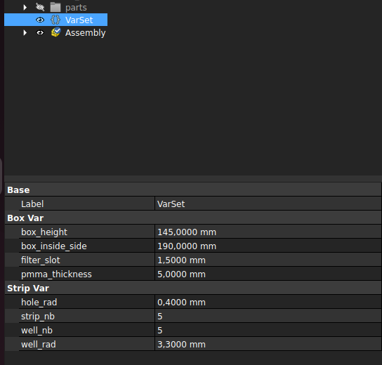
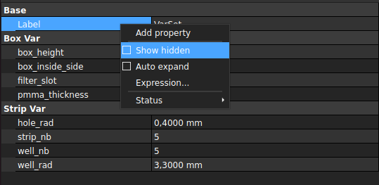

This folder contains a parametric version of the box and strips.  
The Computer Assisted Design (CAD) file was made with **FreeCAD v1.0.0** (v1.0.0 or above is required if you want to open it since the model uses the new Assembly workbench and other new features available since v1).
# Parametric features
This parametric design helps making specific boxes and strips.
## Visible parameters
Most important parameters were kept visible in the Model tree > VarSet > Data.
These are the available parameters : 
| Variable name | Description |
| --- | --- | 
| --- | --- | 

## Hidden parameters
There are also a lot of hidden parameters that you might be interessted to investigate.  
Right click on the VarSet Data > tick *Show hidden*.   

# How to export the files
## 2D files (for laser cutting)
## 3D files (for 3D printing)

