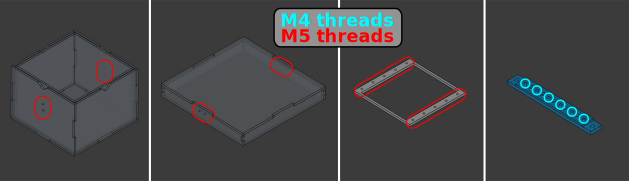
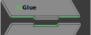

# Assembly Instructions

## Printing and Cutting

1. Select the model you want to build:
    - The exact files we used are located in [../cad/original_files/](../cad/original_files/)
    - A parametric model is available here for modifications: [../cad/modular_cad/](../cad/modular_cad/)

2. Make sure you have all files needed:
    - STL files for 3D printing (the strips)
    - DXF files for laser cutting (the box, the box lid, the strip lids)

3. Create the pieces:
    - The strips are 3D printed with a resin printer, in transparent resin.
    - The other pieces are laser cut from acrylic sheets (5 mm thick for the box, and 1.5 mm thick for the strip lids). Once laser cut, the acrylic sheets can be baked at 80°C for 2 hours to release stresses and prevent cracking during gluing.

4. Thread the holes on the following pieces (before gluing!):
    - Strip attachment: all holes must be M5 threaded.
    - Box outside wall: there are 2 outside walls with 2 holes, they must be M5 threaded.
    - Lid wall: there are 2 walls with 2 holes, they must be M4 threaded.
    - Strip: holes outside and between wells must be M5 threaded.

## Assembly

### Gluing

5. Glue the "strip_attachment" part to the box bottom, with the acrifix glue. Make sure it is aligned and centered.

6. Glue the box, with the acrifix glue. Apply glue to the edges of the walls that are in contact with each other:
    - Start with the inside walls of the box.
    - Then the outside walls.

7. Glue the lid, the way you did with the box.

### Screwing

8. Screw the latches on the box with M5 screws, and loosen the adjusting screw of the latches.

9. Screw the hook on the lid with M4 screws.

10. Screw the strip lids on the strips with the nylon M5 screws.

11. Screw the strips on the bottom of the box with nylon M5 screws.

## Finishing Up

12. Apply the sealing gasket on the inside of the lid box, aligned with the inside walls of the box.

13. Add the optical filters if needed.

14. Close the box, the latches, and tighten the adjusting screws on the latches.

